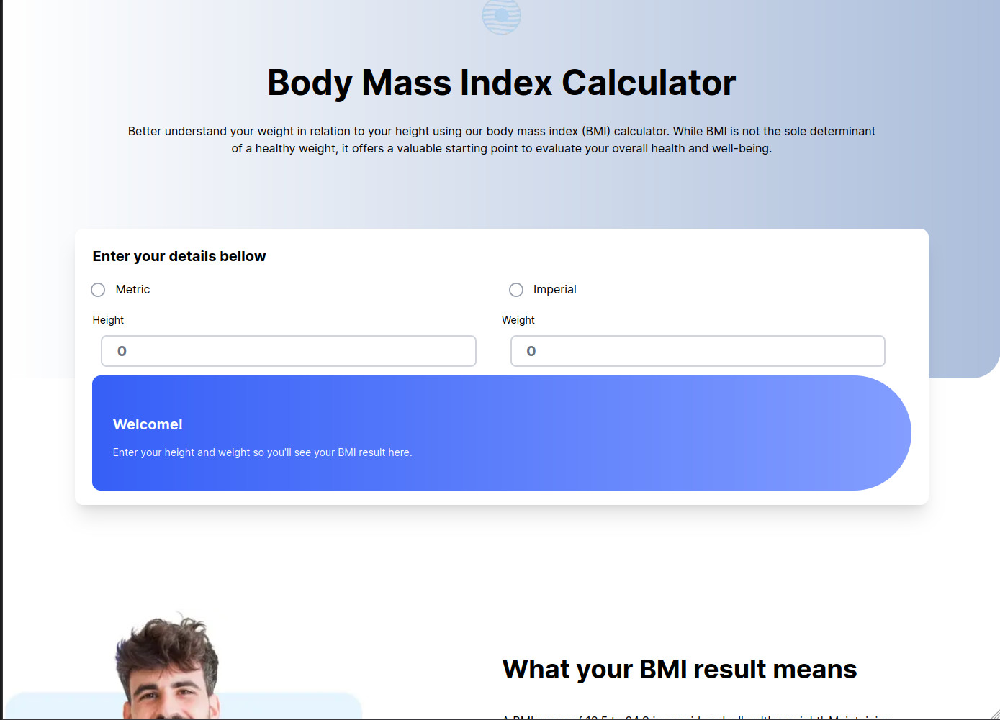

# Frontend Mentor - Room homepage solution

This is a solution to the [Room homepage challenge on Frontend Mentor](https://www.frontendmentor.io/challenges/body-mass-index-calculator-brrBkfSz1T). Frontend Mentor challenges help you improve your coding skills by building realistic projects.

## Table of contents

- [Overview](#overview)
  - [The challenge](#the-challenge)
  - [Screenshot](#screenshot)
  - [Links](#links)
- [My process](#my-process)
  - [Built with](#built-with)
  - [What I learned](#what-i-learned)
  - [Continued development](#continued-development)
  - [Useful resources](#useful-resources)
- [Author](#author)
- [Acknowledgments](#acknowledgments)

## Overview

### The challenge

Users should be able to:

- View the optimal layout for the site depending on their device's screen size
- Calculate the BMI using the International System of Measures of Imperial Measures System

### Screenshot

### Links

- Solution URL: [Add solution URL here](https://github.com/ttsoares/bm-index)
- Live Site URL: [Add live site URL here](https://bm-index.vercel.app/)

## My process

### Built with

- [Responsive] - Started by building the layout for the three resolutions
- [React](https://reactjs.org/) - JS library
- [Next.js](https://nextjs.org/) - React framework
- [React Hook Form](https://www.npmjs.com/package/react-hook-form) - Fine grain form management
- [tailwindcss/forms](https://www.npmjs.com/package/@tailwindcss/forms) - Provides a basic reset for form styles

### What I learned

- How to use a new library: Tailwind/forms.
- Went deep in the functionality of the HookForms.
- Learned solve a challenge without the usually provided assets.

### Continued development

- Build for three resolutions poses new difficulties in the Tailwind infrastructure of CSS.
- Next challenge could be a 'fluid design' that works in all resolutions...

### Useful resources

- Documentation of the React Hook Form was very helpful.

## Author

- Website - [Thomas Tschoepke Soares](https://www.linkedin.com/in/thomas-soares-6791781b/)
- Frontend Mentor - [@ttsoares](https://www.frontendmentor.io/profile/ttsoares)

## Acknowledgments

- [Youtube playlist about Hook Form](https://youtu.be/KejZXxFCe2k) .
